# Classification of Sidewalk Accessibility Features

Sidewalks provide a safe, environmentally-friendly means for pedestrians to move about the city landscape. As a result, sidewalks should benefit everyone. However, for
people with disabilities, poor sidewalk quality can have a detrimental impact on independence, quality of life, and overall physical activity. However, there has been much progress in recent years with regards to collecting sidewalk accessibility issue data and making it transparent/available. However, most of this data is crowdsourced, with the application of machine learning in automatically performing these data collection/analyses only being a relatively recent avenue of investigation. One region of particular interest is the application of AI assistance in the validation of crowdsourced accessibility labels, whether it be automatic or in collaboration with human validation. Manual validation is a laborious task, but has immense applications in data quality and also in increasing the amount of data that can be brought to governmental bodies who can take action in improving sidewalk infrastructure (consider this [resource](https://sidewalk-sea.cs.washington.edu/gallery)). As a result, alleviating the labor that accompanies validation is critical.

## Abstract
In this project, supplemented by the ever-growing Project Sidewalk dataset of 300,000+ image-based sidewalk accessibility labels, we aim to improve on the results/findings from the [2019 iteration](https://github.com/ProjectSidewalk/sidewalk-cv-assets19) of the project, which provided a novel examination of deep learning as a means to assess sidewalk quality in Google Street View (GSV) panoramas. To do so, we focus on one application area, the automatic validation of crowdsourced labels. Our goal is to introduce improvements in two regards: data quality (particularly, the types of image crops we are gathering) and utilizing modern deep learning techniques to highlight spatial/background context in supplementing the classification of the actual accessibility feature. In tackling the issue of data quality, we investigate strategies such as multi-size cropping as well as delving deeper and adjusting the pipeline used to map labels placed in the Project Sidewalk audit interface to the GSV panorama image being cropped from. In regards to model training, we compare strategies such as ensembling various models trained on different sized crops, as well as comparing model quality given a simplified problem space through the binary classification of individual label types. In evaluating the success of our strategies, we provide an analysis on dataset-wide metrics such as accuracy and loss, while also considering label-type-specific metrics such as precision and recall per label type.

## Video Here
<video width="320" height="240" controls>
  <source type="video/mp4" src="https://user-images.githubusercontent.com/52512290/146111588-2d260702-7a3b-4d85-94e5-cdbfa9990279.mp4">
</video>

## Related Work
Our project expands upon the research performed by Weld et al. in 2019 in applying multimodal deep learning to automatically validate crowdsourced labels
and automatically label sidewalk accessibility issues given streetview panoramic imagery. Now, equipped with more validated data, we seek to improve on the results observed in 2019, particularly in regards to automatic crowdsourced label validation. Our goal is to eventually integrate an improved classification pipeline into the current Project Sidewalk validation interface as an "AI assistant" of sorts. To do so, we look to first clean/modify the data acquisition pipeline. Investigation into the 2019 data acquisition pipeline demonstrated inconsistency in the usability of the crops, whether it be inaccurate crop placement or data that is simply trivial due to black space. This issue is one that possibly stems deep into the Project Sidewalk auditing interface itself in terms of data collection, so we are working closely with the lab to gain more accurate data. Clearly, we don't want our models to learn on dirty data. We also look to take different approaches to model training. Some of the novel training strategies attempted in the 2019 paper consisted of utilizing multimodal data (image data and non-image data in the form of positional/geographic features). However, we choose to take a simpler approach and stick to unimodal data (simply image data) as we reason that spatial context is more important (humans can classify accessibility problems well with just image data) and it removes dependencies on additional metadata from Google, which is subject to change in availability. Should we choose to utilize multimodality, we want to explore avenues such as including data in terms of a label's relativity to other labels, for example. Ultimately, as stated before, we want to make automatic label data validation more feasible/reliable as accurate data exposing sidewalk infrastructure issues can incite action from political bodies that make sidewalmks more accessible to all.

## Methodology
### Data Acquisition
As mentioned before, our datasets consisted of crowdsourced labels from the Project Sidewalk database. In order to ensure the quality of the human labels, we only chose validated labels satisfying the following conditions:

`disagree validations <= 2` and `disagree validations < 2 * agree validations`

In addition, we aimed to have a relatively balanced dataset. Given that our explorations for this project were limited to the Seattle Project Sidewalk label dataset, below are the individual label counts for the four accessibility features/problems we aimed to classify:

| Label Type | Label Type ID | Count |
| ---------- | ------------- | ----- |
| Curb Ramp | 1 |   69k    |
| Missing Curb Ramp | 2 |  34k    |
| Obstacle | 3 |    10k     |
| Surface Problem | 4 |  25k    |

This are the counts without filtering the labels that don't satisfy the validation conditions above, so in trying to build a balanced dataset of 10k labels per label type, our final counts were 9998 curb ramps, 10000 missing curb ramps, 8930 obstacles, 10000 surface problems. One thing to note is that labels might have been discarded due to the panorama imagery they were cropped from not existing or the crop size going out of the vertical bounds of the GSV imagery, which will be discussed later. This explains why there are less than 10000 curb ramps despite the overwhelming majority of curb ramps in the Seattle database. The smaller quantity of obstacles is due to the smaller quantity of obstacles in the Seattle database overall.

In querying the Project Sidewalk Seattle database, we looked for these data points per label:

`gsv_panorama_id, sv_image_x, sv_image_y, label_type_id, photographer_heading, label_id`

The `gsv_panorama_id` allowed us to download the associated GSV panorama static image for the panorama the label had been originally placed on in the audit interface from the Project Sidewalk SFTP server containing scraped panorama images from GSV. We then made use of existing utility functionality to make square label crops for each label, centering the crops around the label location on the gsv image (calculated via `sv_image_x, sv_image_y, photographer_heading`). The `label_type_id` gave us the associated label for the image crop and the `label_id` gave us a method to name the label crops. 

#### Multi-size Cropping
One strategy we wanted to try was to get different sized crops per label (still centered on the label in the GSV panorama image) in order to provide more background context to the crops (for example, a smaller crop of a fire hydrant in the middle of the sidewalk - an obstacle - might not show enough sidewalk for even a human to deem the fire hydrant an obstacle). As a result, for each label we made a crop for, we additionally made another crop whose dimensions where 1.5 times greater. Since these images would all end up being resized to `224x224` crops to feed into our models, we were interested in seeing how the greater pixel density of the smaller crops in proximity to the label would compare to the increased background context provided by the larger crops in terms of model accuracy. In addition, as we'll discuss later, we wanted to investigate how a model might improve given access to both these crop types, being able to learn from the higher pixel density as well as the provided background context.

#### Null Crops
In identifying sidewalk accessibility features/problems, we also wanted to make sure our model learned how to predict the absence of the aforementioned accessibility  features/problem. To do so, we implemented a cropping strategy that cropped `n` null crops (where `n` is set by us; for our case, `n = 1`) per GSV panorama image downloaded in attempting to crop the labels. We also designed helper classes that ultimately allowed us to keep track of all the labels that were to be cropped from a given panorama. We then randomly selected a point `(x, y)` on the GSV panorama image as such:

`x = random.uniform(side_space, GSV_IMAGE_WIDTH - side_space), y = random.uniform(- (GSV_IMAGE_HEIGHT/2 - bottom_space), 0)`

Which essentially chose a random point which was horizontally between the edges of the panorama (given some padding) as well as under the vertical middle of the image (and slightly above the bottom of the image). This was in order to best simulate a feasible location on the ground/sidewalk that didn't have an accessibility feature/problem, as the vertical coordinate of the random point is under the horizon (or close to under the horizon, given the pitch of the camera when the GSV panorama was taken). The horizontal and vertical paddings are to make sure the crop doesn't leak over the borders of the image (though, in making crops in general, if a crop would've leaked along the HORIZONTAL edges of the image, we essentially made the crop wrap around to the other side of the panorama as the panoramas encompassed a 360 degree view; this was not the case if it leaked over the VERTICAL edges, as the panoramas did not encompass a 360 degree view vertically).

We then made sure that this random point was at least some `min_dist` away from any other actual labels on the panorama so that we could minimize accidently creating a null crop that could be mistaken for an accessibility feature/problem. We then gave these null crops a label of 0 and provided them as part of our dataset.

*Currently, we have not implemented the multi-size cropping strategy for the null crops, but do note that the two data acquisition strategies are not disjoint*

#### Dataset Evolution
We will quickly describe the dataset iterations we went through.
- Dataset 1: We began with an imbalanced dataset which contained far more null crops. 
- Dataset 2: We created a dataset of ~30k non-null crop labels while waiting to acquire a more balanced dataset with null crops. Note that this dataset was still quite imbalanced due to a lack of obstacle labels in comparison to the other label types.
- Dataset 3: We created a balanced dataset of ~10k labels per label type (including null crops).
- Dataset 4: With the above data acquisition strategies, our final dataset (currently) consists of 20469 null crops, 19996 curb ramps, 20000 missing curb ramps, 17860 obstacles, and 20000 surface problems, derived from applying the multi-size cropping strategy to Dataset 3. Note that this is quite small given that we also have numerous labels from other municipalities; however, in consideration of time and machinery limitations, we decided to keep our dataset a reasonable size for experimentation before fully committing to a long training run.

### Initial Training Attempts
Our initial objective was to pick out some promising network architectures from the [torchvision.models](https://pytorch.org/vision/stable/models.html) package, utilizing transfer learning to fit the architectures to our problem space. Our first dataset had a huge imbalance of null crops and was causing models to just predict null for almost every image, so we did these initial training runs with no null crops while waiting on a more balanced dataset in order to get a rough idea of performance on the non-null classes. We trained several models for 50 epochs using SGD with default hyperparameters (learning rate, momentum, etc.) and no weight decay. We plotted per-class precision and recall, as well as overall accuracy and loss, as a function of epoch. We tried several mid-size architectures including [efficientnet](https://pytorch.org/hub/nvidia_deeplearningexamples_efficientnet/), [densenet](https://pytorch.org/hub/pytorch_vision_densenet/), and [regnet](https://pytorch.org/vision/master/_modules/torchvision/models/regnet.html). Note that each of these models comes in varying sizes, so we selected the largest ones that would fit in the RAM available to us and take a reasonable amount of time to train. We found that all of these models achieved similar performace on the metrics we tracked, but efficientnet and regnet trained significantly faster than densenet, so we focused on these architectures moving forward. This initial round of training revealed some issues such as overfitting and noisy updates. These plots, aquired from efficientnet training runs, are representative of some issues we faced:

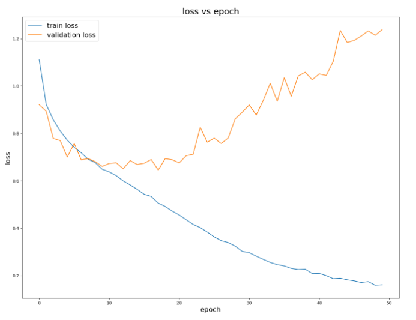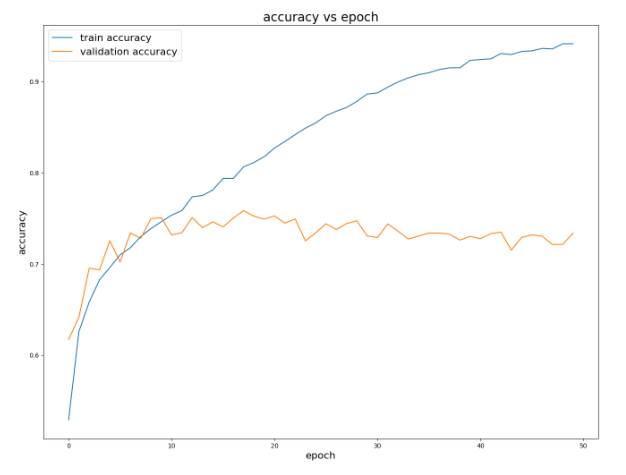

 <figcaption>Increasing loss and decreasing accuracy on validation set, indicative of overfitting</figcaption> 

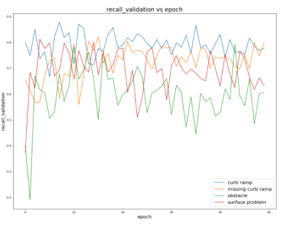 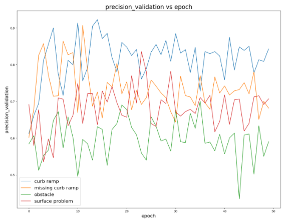

<figcaption>Spiky recall and precision curves, indicating noisy updates</figcaption>

### Improving Training Hyperparameters
To help resolve these issues, we implemented learning rate scheduling and added weight decay to our loss calculations. The best scheduling strategy we found was to decrease learning rate by a factor of .3 every 10 epochs, starting from .01, and the best weight decay we found was around 1e-6. This improvements gave us plots such as the following, training on the same dataset:  
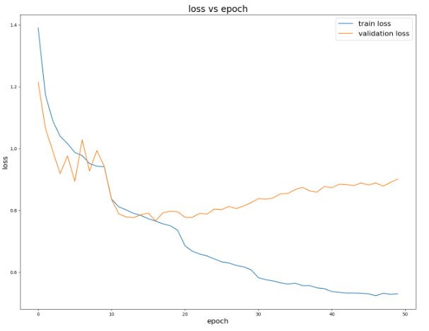
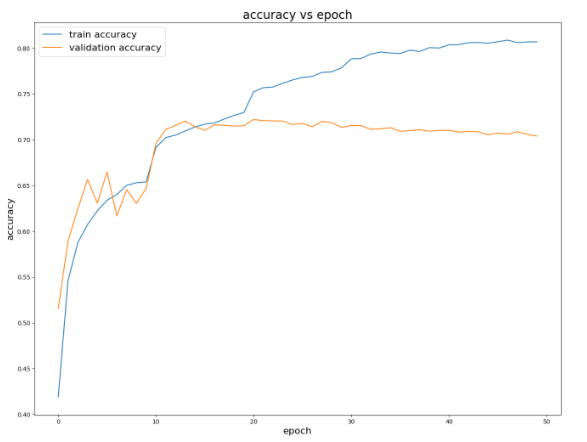

<figcaption>Less overfitting, though still some</figcaption>

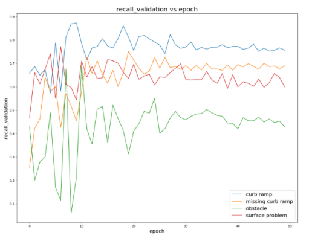
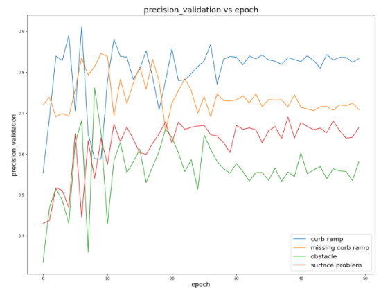

<figcaption>Precision and recall curves begin to converge</figcaption>

### Training on Better Data
 Another glaring issue revealed by our initial training efforts is that obstacles had much lower precision and recall than all the other classes. We believed this was due to imbalances in our dataset, namely that there were much fewer positive examples for obstacles. We first attempted to resolve this by implementing a weighted loss function that penalizes predictions for the more common labels and rewards predictions for the less common labels, and we had some success with this. Precision and recall was a little higher for obstacles, but at the expense of lower precision and recall for the other classes. We felt that aquiring actual balanced data would be better than artificially modifying the loss function, so we took some time to alter our scraper in order to aquire a dataset with roughly 10,000 examples for each class, including null. The following plots show the results of training with this new data and the hyperparameters we determined above:

 
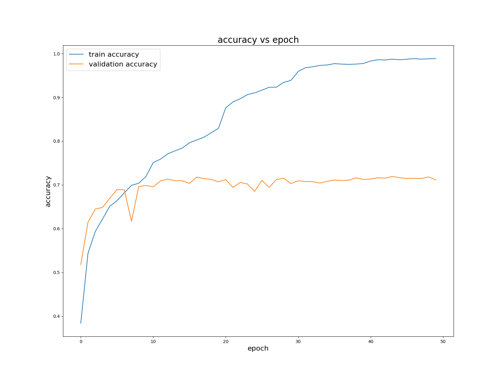

<figcaption>Validation accuracy reaches around 70%</figcaption>

 

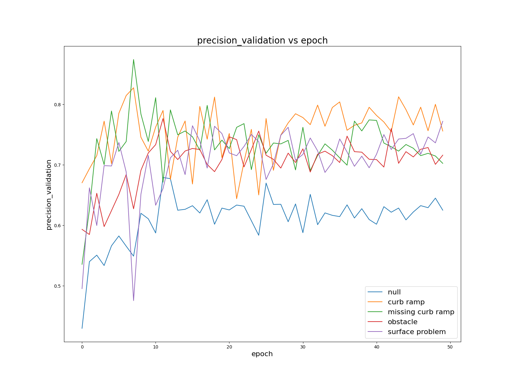

<figcaption>Precision reaches around 70% for obstacles, missing curb ramps, and surface problems, 60% for null, and 75% for curb ramps</figcaption>

 

<figcaption>Recall hovers just below 70% for null and just above 70% for other classes</figcaption>

 

### Ensembling Architectures
In addition to aquiring a better dataset, our next step was coming up with more novel architectures to try and improve performance. A friend of ours pointed us to some interesting documentation on [ensembling](https://ensemble-pytorch.readthedocs.io/en/latest/introduction.html), which is essentially training multiple models and somehow combining their results to give a better overall performance.

Ensembling of Binary Classifiers: One approach we tried that we found interesting involved independently training a binary classifier for each of the 4 non-null classes, and then combining them into a model that passes the combined output of each through an additional fully connected layer to get a multi-class prediction. Our idea here was that it may be easier for a model to learn which images are positive examples of a given class if we just label every other image as a negative example rather than with a variety of other labels. To do this training, we made a new set of labels for each class where all images that aren't a positive example of the class in question are labeled as negative, and then trained with the same dataset. We'll discuss the results of this approach more in the next section, but overall it didn't really work out.

Ensembling of Models Trained on Different Size Crops: The more promising ensembling strategy we used involved taking two image crops for each labeled sidewalk feature. We were able to do this because the original data is street view panoramas with coordinates of sidewalk features, so it's up to us how large to make the crops around each feature. We trained one model on the crops we had in our current dataset (we called these "small"), and trained another model on zoomed out versions of the same crops (we called these "large"). We then combined the models into a model that takes as input both the small and large crop for a given sidewalk feature. For a forward pass, the model passed each image to the corresponding model and combined the output of each to obtain a final prediction vector. We tried simply concatenating the output of each model and passing the result through a single fully-connected layer, as well as more complex strategies such as removing the last layer of each model and passing the larger concatenated feature map through several fully-connected layers with activation functions between each. We'll discuss the results of this approach more in the next section.

## Results/Analysis
Ensembling of Binary Classifiers: When training independent binary classifiers, we found that our models were unable to reach a higher precision or recall on the individual classes than the ordinary multi-class classifiers. For this reason, we did not go to the effort of assembling the binary classifiers in order to make a multi-class prediction. However, this architecture could be tweaked to allow us to make multiple predictions for a given image, which may be useful to us. We'll discuss this more in the next section.

Ensembling of Models Trained on Different Size Crops: The results of this approach are more interesting. After training a model on the "large" crops (more zoomed out), we combined the outputs with the model trained on the normal size ("small") crops and passed them through a fully connected layer. We then trained this final FC layer for some additional epochs, but noticed none of the metrics seemed to be improving so stopped early. As mentioned above, we also tried removing the last layer of each model and passing the larger feature map through multiple fully-connected layers, but our results were better with the former approach. These plots indicate the performance of this ensemble network:

 
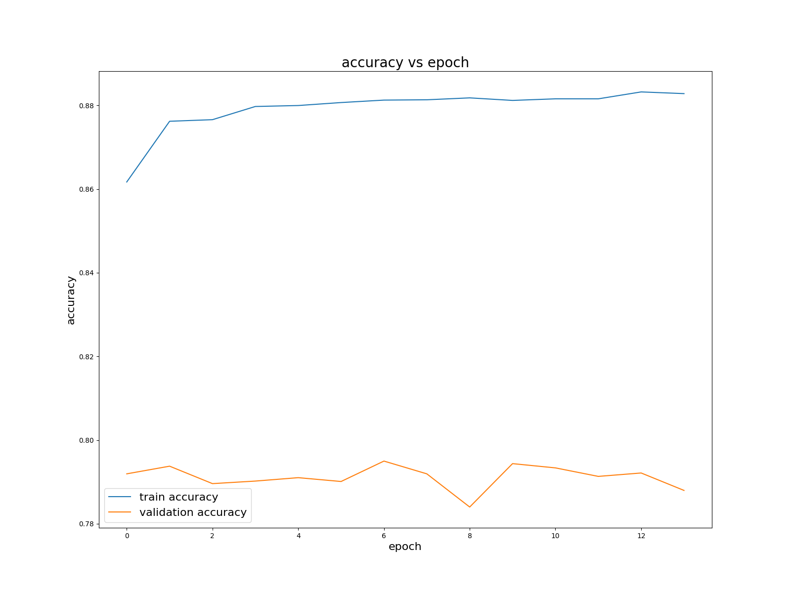

<figcaption>Validation accuracy hovers around 79%</figcaption>

 

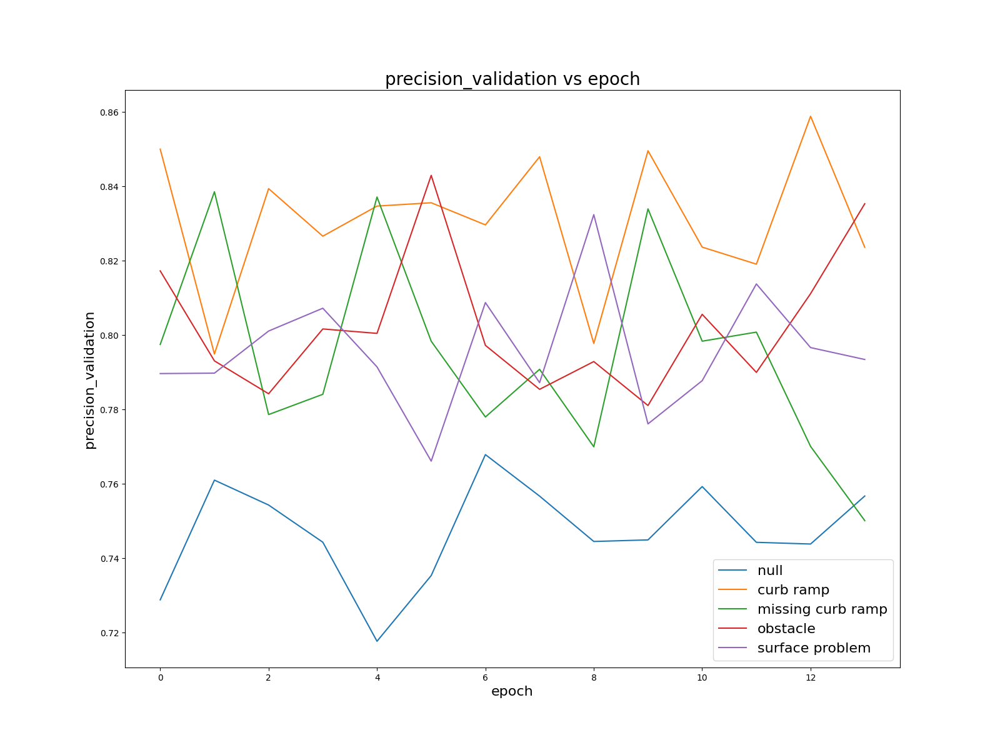

<figcaption>Spiky updates because learning rate is high for early epochs, but precision hovers around 80% for most classes and 75% for null</figcaption>

 

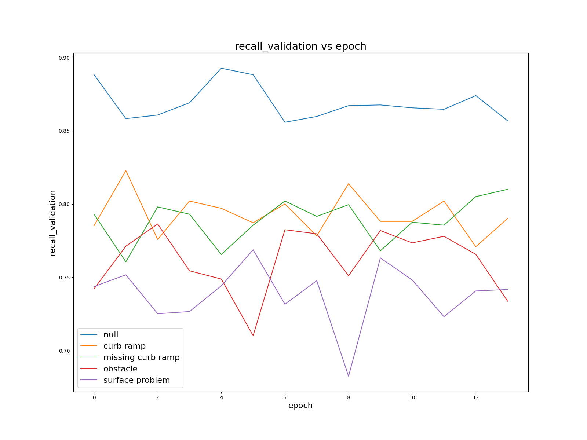

<figcaption>Again, spiky updates because of short training run, but recall hovers between 75% and 80% for most classes and above 85% for null</figcaption>

 

One huge improvement we saw with this network compared to the one trained on the original "small" crops is that the recall for null crops improved a ton, from less than 70% to over 85%. The precision and recall for the other classes, as well as overall accuracy, were significantly higher as well. At this point, we began to wonder how much of this improvement came from combining the results of two models and how much came from just training one of the models on larger crops. So we made training plots for the individual model trained on the large crops:

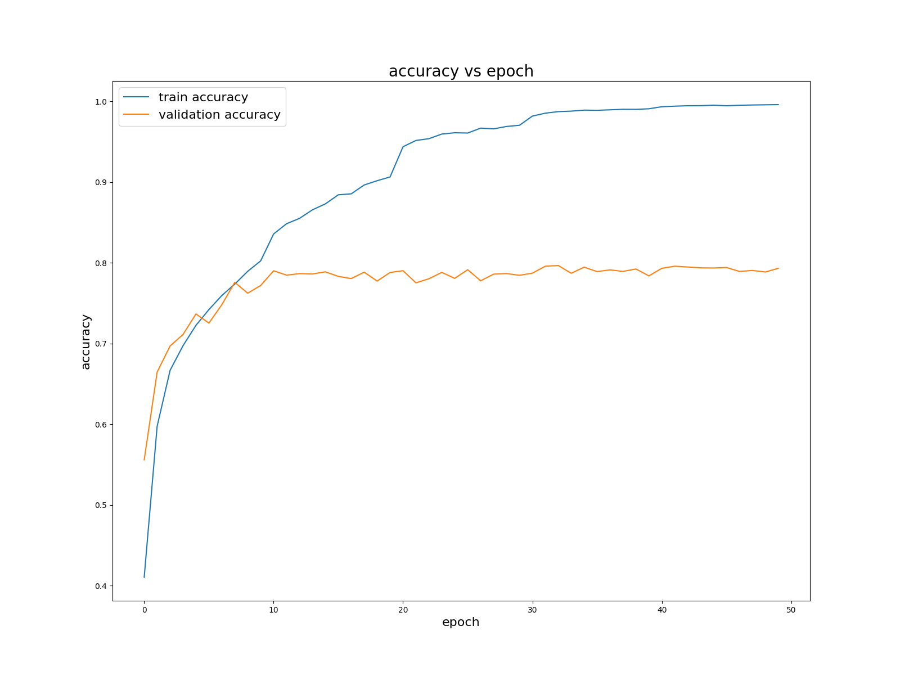

<figcaption>Validation accuracy reaches around 78%</figcaption>

 

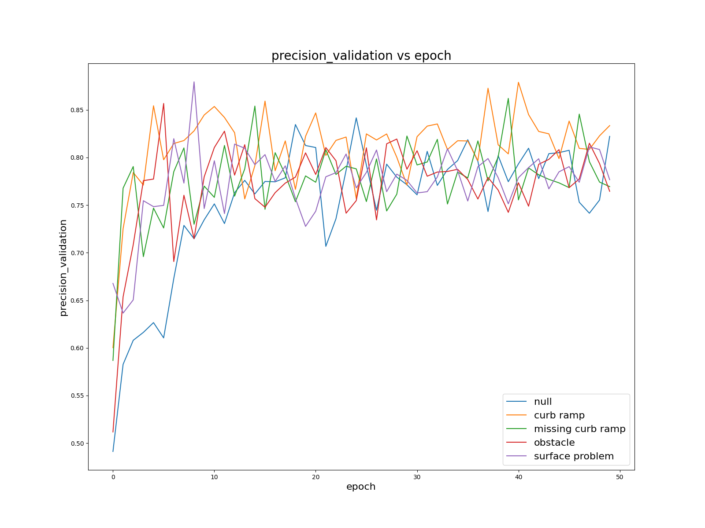

<figcaption>Precision hovers a little below 80% for most classes, including null, and is slightly higher for curb ramps</figcaption>

 

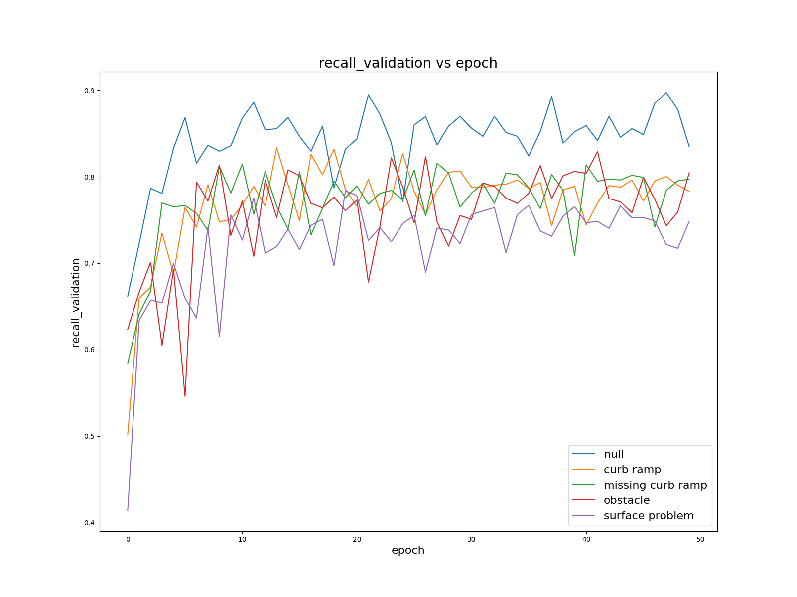

<figcaption>Recall hovers between 75% and 80% for most classes and around  85% for null</figcaption>

 
It seems that validation accuracy and precision are marginally lower than for the ensemble model, but null precision seems a little higher. If anything, the ensemble approach is only slightly better than just training on larger crops, and training on larger crops alone appears far better than training on crops of the original size. This result surprised us because the previous attempt at this project used crops of the size we were using initially, and never mentioned attempting to zoom out further. The best model these people achieved got slightly better performance than we reached here, but it was also much larger than any model we could train with the RAM resources available to us and was trained on way more images than we could fit on the disk space available to us. We believe that if we repeated this group's training efforts with more zoomed out crops, we could achieve better results based on how much our results improved just by zooming out. We'll discuss this more in the next section.

## Next Steps
### Cleaner Data
We still notice a lot of "dirty" labels such as the ones below: 

While we have resolved some issues due to labels being too close to the horizontal edges of the image leading to cut-off crops as well as GSV imagery of different resolution (some GSV panorama images we downloaded were `13312x6656`, while others were `16384x8192`) leading to incorrectly placed labels (as the image coordinates of the label were incorrectly scaled), we still see incorrect labels of the above variety. Evidently, this is not ideal for training an effective model.

One hypothesis we are considering is that the translation from the label placement on the Project Sidewalk audit interface to the GSV panorama image is faulty. For context, below is a screenshot of the Project Sidewalk audit interface followed by an example of a GSV panorama image (the panorama being rendered in the audit interface isn't the same panorama as the example GSV panorama image):

Essentially, we map the label's viewport or "canvas" coordinates (where the viewport is essentially just a windowed region over a portion of the panorama that may be zoomed in/out) to a coordinate over the entire panorama. The current implementation of the mapping process is derived from this [stackoverflow post](https://stackoverflow.com/questions/21591462/get-heading-and-pitch-from-pixels-on-street-view). The derived heading/pitch of the label is then translated back into GSV image coordinates over the entire GSV image panorama. One area of contention is the translation of heading/pitch to a pixel coordinate, as the [current implementation](https://github.com/ProjectSidewalk/SidewalkWebpage/blob/develop/public/javascripts/common/UtilitiesPanomarker.js#L130) utilizes the idea that the change-in-degree per pixel is linear, which is not necessarily the case.

Another solution to the problem if the math doesn't work out is to simply build a data cleaning interface where we can manually prune faulty labels (as they are a minority of the total crops). However, while the implementation of the interface isn't necessarily difficult, the manual cleaning process doesn't scale well with increased dataset size (a reason for why we decided against this strategy for the current dataset given the timeline).
### Experimenting with More Training Strategies

### A More Complete Validation Pipeline
Currently, our implementation for the validation pipeline is to simply pass a crop into the model and output what the model predicts the class of the crop is (the top-1 result). The human validator could then choose to agree or disagree. However, this is a flawed approach, as there are many instances of label crops that can be labeled as multiple accessibility features. For example, consider this "hard" example:

This was reported as an incorrect labeling by the model, yet this is not necessarily the case. This is a curb ramp, but there is evidently surface problems as seen through the grassy cracks and uneven surface. Therefore, we propose a different architecture. We will train individual binary classifiers on the four respective label types, each outputting a confidence of how likely an inputted image is to be of the respective label type. Therefore, for any image to be validated, for each label type model which outputs a confidence for the image above a certain threshold (say 90%), the AI validation pipeline will output that label type as an option. Given the set of options, one could check whether the human validation for the image is in the set as a measure of validity. 

# Technical Details
## Setup
1. Acquire sftp server credentials from Mikey and place them at the root of the project folder as `alphie-sftp`.
2. Run `pip3 install -r requirements.txt`.
3. Create a folder called `rawdata` in the project root and add a metadata csv (from Mikey) and update `path_to_labeldata_csv` in `scrape_and_crop_labels.py`.
4. Make sure to remove `batch.txt`, `crop_info.csv`, `crop.log`, `pano-downloads/`, and `crops/`.
5. Run `python3 scrape_and_crop_labels.py`.
6. Crops will be stored in the generated `crops` folder.

## Training
### Training on UW Instructional GPU machine
1. SSH into machine
2. Run this command to create a new nested bash session: `tmux new -s my_session`
3. Detach the bash session so that it persists after the SSH connection is dropped via `ctrl+b` then just `d`
4. Reattach/re-enter the session via `tmux attach-session -t my_session`
5. Kill the bash session by stopping running processes and typing `exit` in the terminal
 
